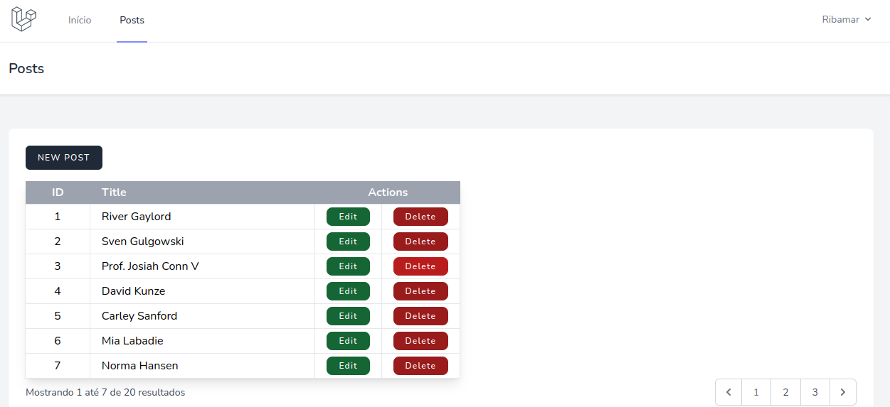
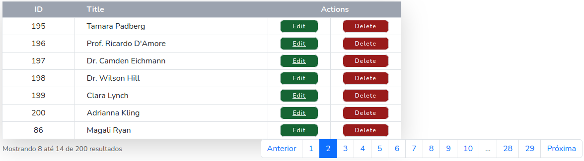
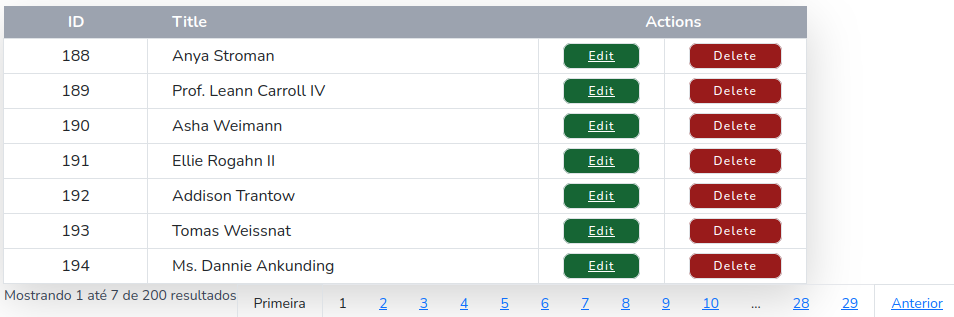

# CRUD com Laravel 9 Breeze e Tailwind

## Meu primeiro CRUD com Breeze e Tailwind



## Usando Bootstrap



Ainda não conseguir fazer assim com Tailwind

## Chegando perto



Estou usando a versão 9.20.0 do Laravel

Segui o tutorial abaixo

https://bittenbook.com/laravel-9-tutorial-using-breeze/

Instalei o laravel 9
```
composer create-project laravel/laravel crud-breeze
cd crud-breeze
composer require laravel/breeze --dev
php artisan breeze:install
npm install
npm run build
```
Criar o arquivo para a SQLite. Se preferir use MySQL ou outro suportado

touch database/database.sqlite

Copiei o .env.example para .env e deixei a configuração assim:

DB_CONNECTION=sqlite
DB_DATABASE=/home/ribafs/crud-breeze/database/database.sqlite

php artisan migrate

## Factory

Criei um factory para post e podemos fazer

php artisan tinker

Post::factory()->count(20)->create()

Segui o tutorial e criei este aplicativo (veja detalhes no link acima)

## Menu principal

Usei o arquivo abaixo como menu

resources/views/layouts/navigation.blade.php

## Paginação

Adaptei do código gerado pelo 

https://github.com/appzcoder/crud-generator

## Testando

php artisan key:generate

npm install

npm run dev

Abra outra janela do terminal/prompt, se no Mint pode criar uma segunda aba com Ctrl+Shift+T

Obs.: esta mudança do laravel 9, exigindo que se abra outra janela tem um efeito positivo. As alterações agora, depois de salvas não mais exigem que se atualize a página do navegador, ela se atualiza automaticamente.

Execute

php artisan serve

http://127.0.0.1:8000/register

Crie um usuário e acesse com ele.

## License

The Laravel framework is open-sourced software licensed under the [MIT license](https://opensource.org/licenses/MIT).
